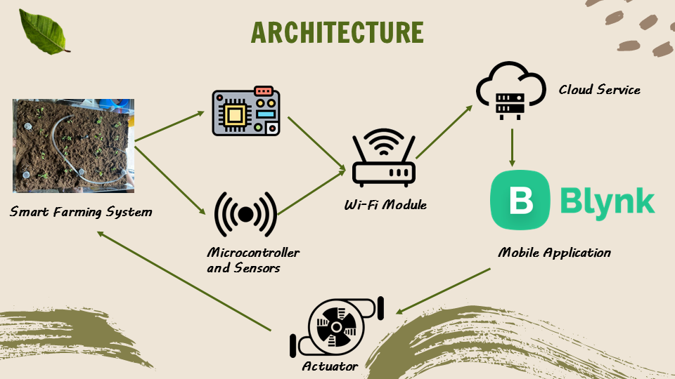

# Carefree-Smart-Farming-System

Utilize the Free Blynk IoT Platform to create an Urban Lifestyle carefree smart farming system Dashboard

# Prototype Features
1. Smart monitoring mobile apps
-Blynk mobile apps will be installed on every customer’s smartphone
-show the soil humidity, fertilizer level and allow control to some features such as switching off the pest control feature at night.

2. Carefree and minimal maintenance  
-only minimal maintenance which is refilling the fertilizer container once a month and replenishing the big water tank when it is out of water. 

#System Architechture

# Dashboard

# Challenge

# What's Next
"Data is just like crude. It’s valuable, but if unrefined it cannot really be used." - Michael Palmer
